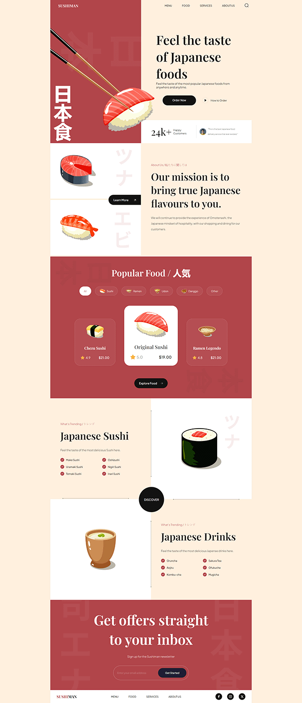

# [Sushiman Responsive Web Theme Html Css Website](https://sushiman-responsive-website.netlify.app/)

Welcome to the Sushi Delight Responsive Theme repository! This premium, developer-friendly theme is designed to create stunning, responsive websites with a delightful sushi theme. Perfect for restaurants, food bloggers, or anyone looking to add a touch of elegance to their web presence.

[](https://sushiman-responsive-website.netlify.app/)

# Table of Contents

1. ⬇️ [Installation](#installation)
2. 📂 [Folder Structure](#folder-structure)
3. ⚙️ [Tech Stack](#tack-stack)
4. 🛠️ [Features](#features)
5. 🤝 [Connect With me](#contact)
6. 🧾 [Credit](#credit)

## <a name="installation">⬇️ Installation</a>

Follow these steps to set up the project locally on your machine.
**Prerequisites**
Make sure you have the following installed on your machine:

-   [Git](https://git-scm.com/)
-   [Node.js](https://nodejs.org/en)
-   [npm](https://www.npmjs.com/) (Node Package Manager)

**Cloning the Repository**

```bash
$ git clone https://github.com/prantomollick/sushiman-responsive-web-theme-html-css.git
$ cd sushiman-responsive-web-theme-html-css
```

**Installation**
Install the project dependencies using npm:

```bash
$ npm install
```

Running the Project

```bash
$ npm run dev
```

Open http://localhost:5173 in your browser to view the project.

## <a name="folder-structure">📂 Folder Structure</a>

```
.
├── README.md
├── assets
│   ├── about_bg1.png
│   ├── about_bg2.png
│   ├── arrow-horizontal.svg
│   ├── arrow-left.svg
│   ├── arrow-right.svg
│   ├── arrow-up-right.svg
│   ├── arrow-vertical.svg
│   ├── check.svg
│   ├── facebook.svg
│   ├── instagram.svg
│   ├── japanese_drinks.png
│   ├── japanese_sushi.png
│   ├── menu.svg
│   ├── play-circle.svg
│   ├── popular_bg.png
│   ├── search.svg
│   ├── star.svg
│   ├── subscribe_bg.png
│   ├── sushi-1.png
│   ├── sushi-10.png
│   ├── sushi-11.png
│   ├── sushi-12.png
│   ├── sushi-2.png
│   ├── sushi-3.png
│   ├── sushi-4.png
│   ├── sushi-5.png
│   ├── sushi-6.png
│   ├── sushi-7.png
│   ├── sushi-8.png
│   ├── sushi-9.png
│   ├── twitter.svg
│   └── user.png
├── css
│   ├── sections
│   │   ├── about.css
│   │   ├── footer.css
│   │   ├── header.css
│   │   ├── hero.css
│   │   ├── popular.css
│   │   ├── subscribe.css
│   │   └── trending.css
│   └── styles.css
├── index.html
├── js
│   └── script.js
├── package-lock.json
├── package.json
└── public
    └── sushi.png
```

## <a name="tack-stack">⚙️ Tech Stack</a>

-   HTML5
-   CSS 3
-   AOS [Animate on scroll library](https://www.npmjs.com/package/aos)

## <a name="features">🛠️ Features</a>

### Key Features and Techniques

-   **CSS Variables**: Utilize CSS variables to maintain a consistent and easily adjustable styling approach throughout the project.
-   **Importing CSS Files**: Promote modularity and organization in styling by importing CSS files into others.
-   **Flex and Position Properties**: Employ flex and position properties in CSS to create responsive and well-structured layouts.
-   **Rendering HTML through JavaScript**: Enhance code efficiency by rendering HTML through JavaScript using reusable functions.
-   **Smooth Animations**: Implement smooth and subtle animations to enhance the overall user experience, focusing on fluid transitions.
-   **BEM Methodology**: Follow the Block Element Modifier (BEM) methodology for naming classes, promoting a clear and maintainable structure.
-   **Organized File and Folder Structure**: Maintain a well-organized file and folder structure for easy navigation and management of project assets.
-   **Responsive Design**: Ensure the application is completely responsive across all devices, employing responsive design techniques such as media queries and fluid layouts.

### Website Sections

-   **Navigation Bar**
-   **Creative Hero Section**
-   **About Us Section**
-   **Popular Food, Trending Sushi, and Drinks Sections**
-   **Newsletter Signup**
-   **Footer**

## <a name="contact">🤝 Connect With me</a>

👥 [@prantomollick](https://www.linkedin.com/in/prantomollick/)
❌ [@prantomollick55](https://x.com/prantomollick55)
✉️
🌎 https://prantomollick.com

## <a name="credit">🧾 Credit</a>

<em><samll>This project is develope to followed by the tutorial of [JavaScript Mastery](https://www.youtube.com/watch?v=QRrPE9aj3wI)</samll></em>
